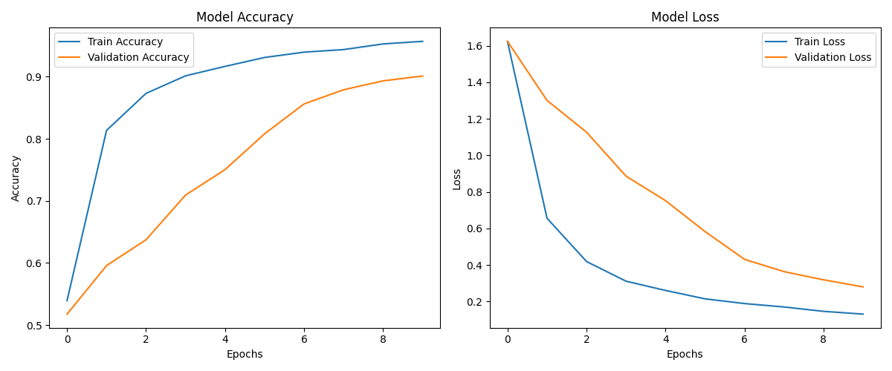
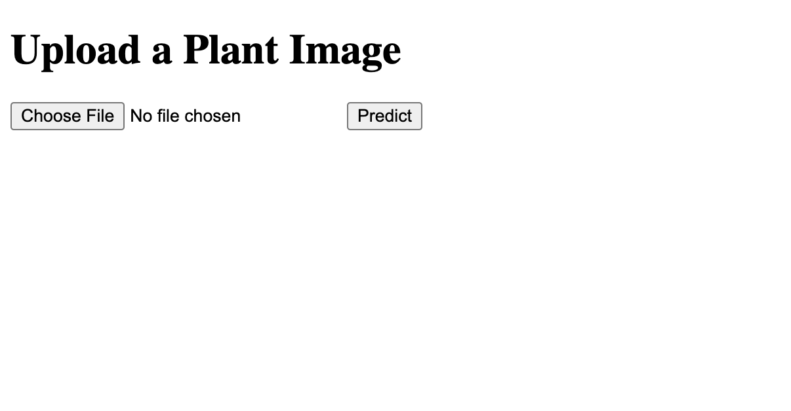
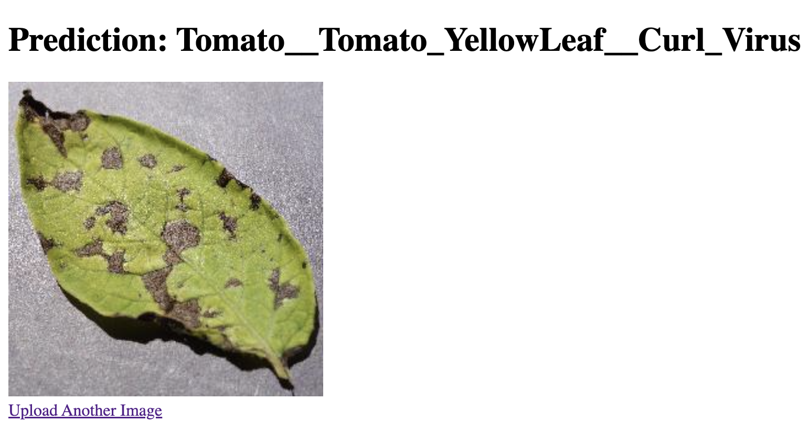

# **Plant Disease Detection**

## Table of Contents
- [Introduction](#introduction)
- [Problem Statement](#problem-statement)
- [Data](#data)
- [Project Structure](#project-structure)
- [Data Exploration](#data-exploration)
- [Data Preprocessing](#data-exploration)
- [Model Building and Evaluation](#model-building-and-evaluation)
- [Source Code Overview](#source-code-overview)
- [Web Application](#web-application)
- [Conclusion](#conclusion)

## **Introduction**
This project is an end-to-end plant disease detection system using traditional deep learning and transfer learning approaches. It involves detecting plant leaves in images, classifying them based on diseases, and setting up a Flask web application to make predictions on user-uploaded images.

## **Problem Statement**

Plant diseases can significantly affect crop yield and quality. Early detection and accurate classification of plant diseases are crucial for effective management and prevention. This project aims to build a system that can:

- Detect and segment plant leaves from images.
- Classify the detected leaves into different disease categories using a trained deep learning model.
- Provide a user-friendly web interface where users can upload images of plant leaves and receive predictions on the disease type.

## **Data**
The dataset used for this project is a collection of plant leaf images, each labeled with a disease type or as healthy. The data is categorized into several classes, representing various plant diseases.

**Data Classes**

The dataset includes the following classes:

- Tomato_healthy: Images of healthy tomato leaves.
- Potato___Early_blight: Images of potato leaves affected by early blight.
- Tomato__Tomato_YellowLeaf__Curl_Virus: Images of tomato leaves affected by Yellow Leaf Curl Virus.
- Tomato_Early_blight: Images of tomato leaves affected by early blight.
- Tomato__Target_Spot: Images of tomato leaves affected by target spot.
- Potato___Late_blight: Images of potato leaves affected by late blight.
- Tomato_Leaf_Mold: Images of tomato leaves affected by leaf mold.
- Tomato_Spider_mites_Two_spotted_spider_mite: Images of tomato leaves affected by spider mites.
- Tomato_Septoria_leaf_spot: Images of tomato leaves affected by septoria leaf spot.
- Tomato__Tomato_mosaic_virus: Images of tomato leaves affected by mosaic virus.
- Pepper__bell___Bacterial_spot: Images of bell pepper leaves affected by bacterial spot.
- Tomato_Bacterial_spot: Images of tomato leaves affected by bacterial spot.
- Tomato_Late_blight: Images of tomato leaves affected by late blight.
- Pepper__bell___healthy: Images of healthy bell pepper leaves.
- Potato___healthy: Images of healthy potato leaves.

[Data Source: kaggle](https://www.kaggle.com/datasets/emmarex/plantdisease/data)

## **Project Structure**

**Note:** The raw image dataset located in the `data/raw` directory has not been included in this repository due to GitHub's file size upload limitations.

```plaintext
plant_disease_detection/
│
├── data/
│   ├── raw/
│   │   └── archive (7).zip            # Raw dataset
|   |   └── PlantVillage               # Plant images
│   ├── processed/                     # Processed data
|   |   └── test                       # Test data
|   |   └── train                      # Training data
|   |   └── val                        # Validation data
│   ├── models/                        # Trained model
│   └── notebooks/                     # Jupyter notebooks for data exploration, data processing and model training
│
├── src/
│   ├── detect_plant_disease.py        # Script for detecting plant leaves and predict diseases
│   └── predict_plant_disease.py       # Script for predicting diseases
│
│   └── plant_images/                  # Directory containing sample plant images
│   └── plots/                         # Directory containing plots  
├── App/
│   ├── app.py                         # Flask application for the web interface
│   ├── templates/
│   │   ├── index.html                 # HTML template for uploading images
│   │   └── result.html                # HTML template for displaying prediction results
│
└── README.md                          # Project documentation
└── requirements.txt                   # Python dependencies
```

## **Data Exploration**
In the data exploration phase, the dataset was analyzed to understand its structure and quality. Key tasks include:

- **Unzipping and Organizing Data:** Extracting images from the zip file and organizing them into directories.

- **Loading and Visualizing Images:** Displaying sample images to check for class distribution and data quality.

Below is a sample of image data from each class.


## **Data Preprocessing**
Data preprocessing involves preparing the raw data for model training. Steps include:

- **Organizing Data:** Importing image datasets.
- **Resizing Images:** Standardizing image sizes to match model input requirements.
- **Data Augmentation:** Applying techniques like rotation, flipping, and scaling to increase data variability and robustness.
- **Splitting Data:** Dividing the dataset into training, validation, and test sets to evaluate model performance effectively.

## **Model Building and Evaluation**

### **Model Building**
- **Architecture:** A convolutional neural network (CNN) with transfer learning techniques was used. Pre-trained model, MobileNetV2 was employed and fine-tuned for the dataset dataset.

- **Training:** The model was trained on the processed training data with a validation set to tune hyperparameters and avoided overfitting.

### **Evaluation**
After fine-tuning for 10 epochs, the model achieved the following results:

**Training Results**
- Training Loss: 0.1306
- Training Accuracy: 95.69%

**Validation Results**
- Validation Loss: 0.2796
- Validation Accuracy: 90.10%

**Test Results**
- Test Loss: 0.3199
- Test Accuracy: 89.24%

**Training history:**


**Analysis**

- **Training Accuracy:** The high training accuracy of 95.69% demonstrates that the model has effectively learned the features from the training data.
- **Validation Accuracy:** With 90.10% accuracy on the validation set, the model shows good generalization to unseen data, indicating it is not overfitting.
- **Test Accuracy:** The model maintains strong generalization with 89.24% accuracy on the test set, highlighting its effectiveness in predicting plant diseases in new images.

## **Source Code Overview**

This project contains two core scripts for detecting plant leaves and predicting diseases, as well as a web interface using Flask. Below is a detailed explanation of each component and usage examples.

### `src/` Folder
1. **`detect_plant_disease.py`**

This script detects plant leaves from an image using contour detection and predicts the diseases using a trained model. It applies a mask to segment green leaves and identifies disease based on the cropped sections of the image.

**How to Run:**
To detect a plant disease from an image, navigate to `src` directory and execute the following command in the terminal:
```bash
python detect_plant_disease.py --image_path path/to/image.jpg
```
Replace `path/to/image.jpg` with the actual path to the image you want to process. This will output the image with detected leaves, bounding boxes, and predicted diseases.

2. **`predict_plant_disease.py`**

This script takes an image as input, pre-processes it, and predicts the plant disease using a trained model.

**How to Run:**
To predict plant disease from an image, navigate to the `src` directory and execute the following command in the terminal:
```bash
python predict_plant_disease.py --image_path path/to/image.jpg
```
Replace path/to/image.jpg with the actual path to your image file. The script will return the predicted plant disease.

## **Web Application**
The project includes a simple web interface built using Flask to make plant disease detection easier for users. You can upload images of plant leaves, and the web app will predict the disease.

- **`app.py`**: This is the main file that runs the web application. It allows users to:

    - Upload an image of a plant leaf.
    - Get a prediction about the disease affecting the plant.

- **How to Run:** To run the web application, follow these steps:
    - Open a terminal and navigate to the project folder.
    - Run the command:
    ```bash
    python App/app.py
    ```
    - Open your browser and go to your localhost (http://127.0.0.1:5000/). You will see the upload page where you can choose a plant image.
    - Click on `Choose File` button to select a plant image from your computer, and click "Predict".
    
    - After a few seconds, the result page will show the prediction for the plant disease along with the uploaded image.
    

## **Conclusion**
This project demonstrates an end-to-end solution for plant disease detection using both traditional deep learning and transfer learning approaches. From data preprocessing and model training to deploying a web application, it offers a practical approach to detecting diseases in plant leaves. With high accuracy and a user-friendly interface, the system can be further improved and adapted for detecting other types of plant diseases.